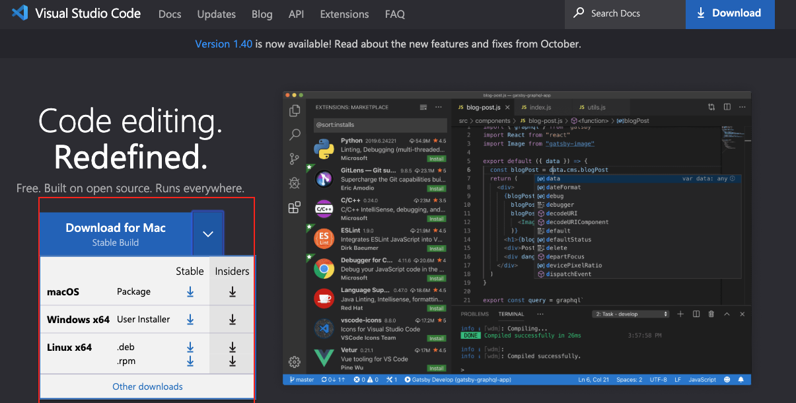

# VARK - Fabrik : 
This is the core front-end application for Vark

- [Setup](#setup)
- [How to Use Repo](#how-to-use-repo)
- [Tech stack](#Tech Stack)
- [Testing](#testing)


## Setup
### Install Node.js


After downloading double click and install


We can check if node is installed on our local machine by opening our device terminal or command prompt.

```sh
$ node -v
```
### Install pnpm

Then once the node is installed its time to go ahead and install pnpm, 
Install [pnpm](https://pnpm.io/installation)

### Browser

There are many browsers out there. However, At fabrik we strongly recommend Google Chrome. : 

Install [google chrome](https://www.google.com/chrome/)

### Code Editor

Visual studio code is a very popular open-source text editor. I would recommend to [download Visual Studio Code](https://code.visualstudio.com/)


Once the installation is done you can go ahead and start using the Repo

## How to Use Repo

Open terminal or Windows powershell and run the following commands :

```bash
git clone https://github.com/Syedkhadeer-51/Fabrik-r3f.git
cd Fabrik-r3f
```
Then once you're in Fabrik-r3f, 

```bash
pnpm install
```
This will install and resolve all the dependencies required to proceed with the project

## Run the developement server :

```bash
pnpm run dev
```

Go ahead, Make your changes by creating a new branch from main 

```bash
git checkout -b "branch name"
```
Once done with the changes, commit them with a message an push it to the respective branch created by you, For instructions on committing and pushing changes, refer to the [Github-documentation](https://docs.github.com/en/get-started/quickstart)

## Tech Stack : 
Refer the links provided with the below frameworks to get a better understanding of the folder structure and syntaxes specific to the requirements :

[Next.js](https://nextjs.org/)
[React-three-fiber](https://docs.pmnd.rs/react-three-fiber/getting-started/introduction)
[Three.js](https://threejs.org/)
[pmndrs-drei : R3f components](https://github.com/pmndrs/drei)
[Jest](https://jestjs.io/docs/getting-started)


## Testing: 
At fabrik we prefer Test-Driven Development (TDD) approach to build components in a simple way.

To quicky get started create a test file with .test.tsx extension for the respective component within __tests__ folder available at the root of the application, 

and then run : 

```bash
pnpm test
```

This goes through all the test cases on watch mode and prints result on you're terminal. 

For detailed understanding of how to write test cases, please refer :
[Jest](https://jestjs.io/docs/getting-started)
[React-three-fiber: Testing](https://docs.pmnd.rs/react-three-fiber/tutorials/testing)


